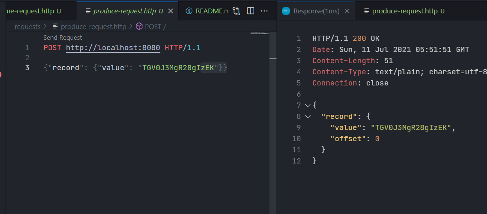

Commit log prototype
---
Distributed services study

Usage
---
```
go run ./cmd/server/main.go
```

Requests in requests folder
---

This requests are used with REST Client vscode extension

Just open the file with the extesion installed and send request, eg:

